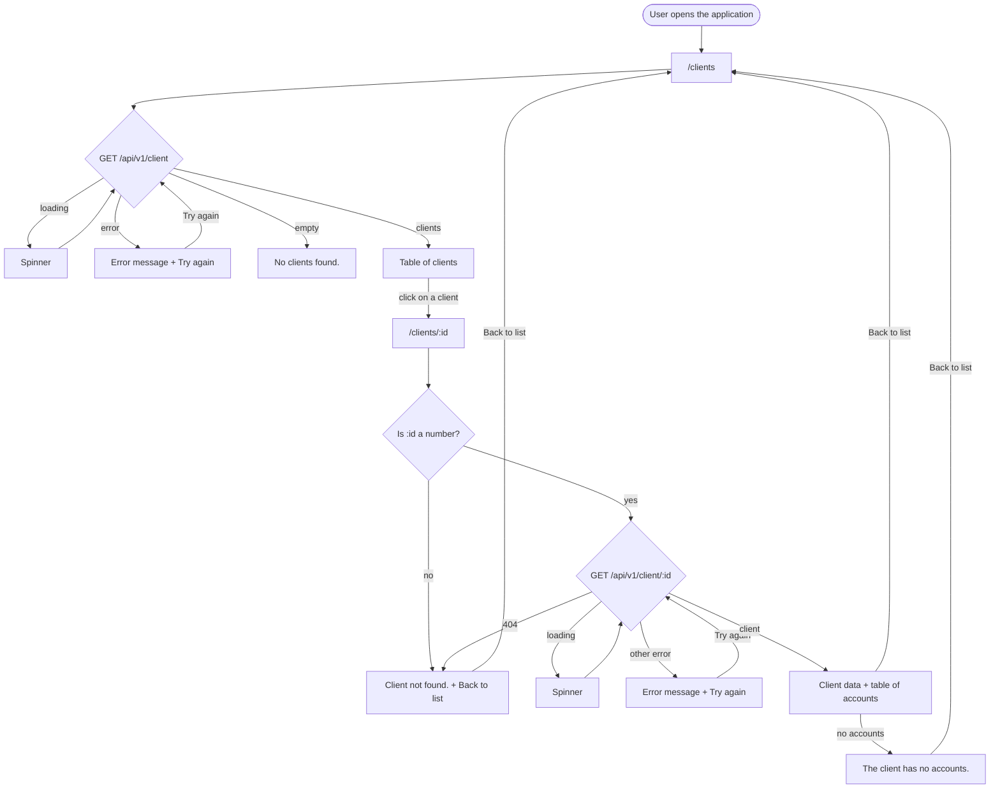

# HB-13: Client Screens — User Flow

```mermaid
flowchart TD
    Start([User opens the application]) --> List["/clients"]
    List --> LoadList{GET /api/v1/client}
    LoadList -- loading --> ListSpinner[Spinner]
    ListSpinner --> LoadList
    LoadList -- error --> ListError[Error message + Try again]
    ListError -- Try again --> LoadList
    LoadList -- empty --> ListEmpty[No clients found.]
    LoadList -- clients --> ListTable[Table of clients]

    ListTable -- click on a client --> Detail["/clients/:id"]
    Detail --> ValidId{Is :id a number?}
    ValidId -- no --> NotFound[Client not found. + Back to list]
    ValidId -- yes --> LoadDetail{GET /api/v1/client/:id}
    LoadDetail -- loading --> DetailSpinner[Spinner]
    DetailSpinner --> LoadDetail
    LoadDetail -- 404 --> NotFound
    LoadDetail -- other error --> DetailError[Error message + Try again]
    DetailError -- Try again --> LoadDetail
    LoadDetail -- client --> DetailCard[Client data + table of accounts]
    DetailCard -- no accounts --> NoAccounts[The client has no accounts.]

    DetailCard -- Back to list --> List
    NoAccounts -- Back to list --> List
    NotFound -- Back to list --> List
```

## Notes
- Every screen can be opened directly by its URL and survives a page refresh.
- The browser back button behaves the same as the "Back to list" link.
